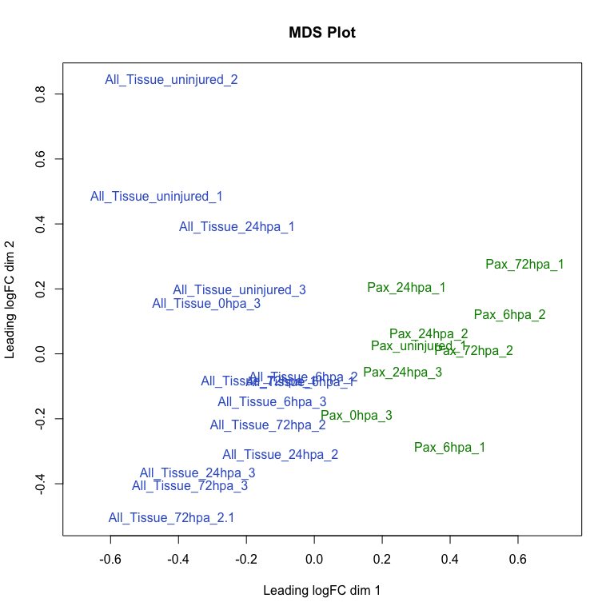
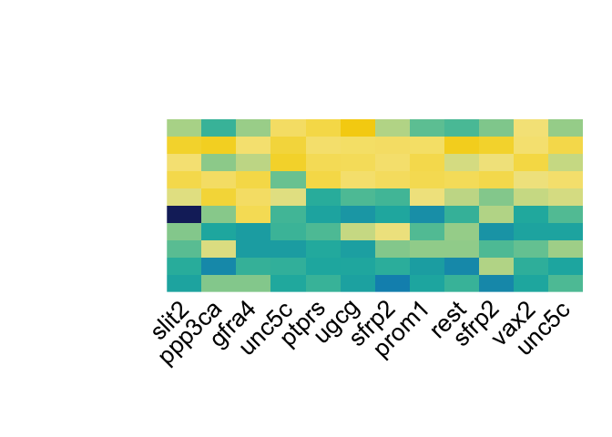
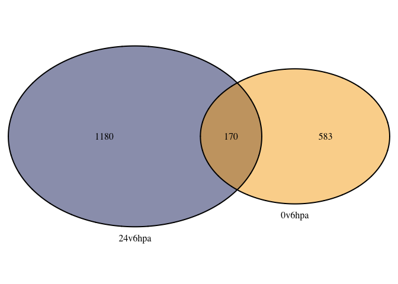
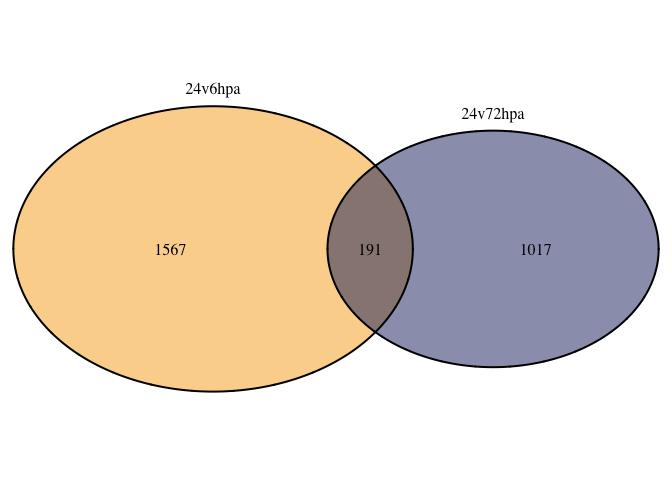
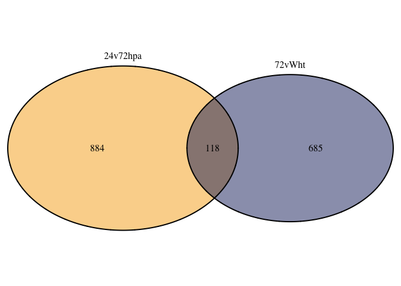

ATAC Figures
================
Anneke Kakebeen
13 Aug 2019

-   [Setting up project: ATAC](#setting-up-project-atac)
-   [Read in data for figures](#read-in-data-for-figures)
-   [Figure 2B](#figure-2b)
-   [Figure 2C: tss plots](#figure-2c-tss-plots)
-   [Figure 2E: \# of peaks called DA between conditions](#figure-2e-of-peaks-called-da-between-conditions)
    -   [Number of peaks](#number-of-peaks)
-   [Figure 2F: GO analysis of aggregate pax v all regions](#figure-2f-go-analysis-of-aggregate-pax-v-all-regions)
    -   [PAX &gt; All](#pax-all)
    -   [ALL v pax GO](#all-v-pax-go)
-   [Figure 2G: heat map of terms in neurogenesis](#figure-2g-heat-map-of-terms-in-neurogenesis)
-   [Figure 3A: heatmaps for all DA regions at 6hpa, 24hpa, 72hpa](#figure-3a-heatmaps-for-all-da-regions-at-6hpa-24hpa-72hpa)
    -   [6hpa Heatmap](#hpa-heatmap)
    -   [24hpa Heatmap](#hpa-heatmap-1)
    -   [72hpa Heatmap](#hpa-heatmap-2)
-   [Figure 3B: venn diagrams for \# of regions](#figure-3b-venn-diagrams-for-of-regions)
    -   [Venn diagram data set up](#venn-diagram-data-set-up)
    -   [6hpa venn diagram](#hpa-venn-diagram)
    -   [24hpa venn diagram](#hpa-venn-diagram-1)
    -   [24hpa venn diagram](#hpa-venn-diagram-2)
-   [Figure 3C: Gene ontology analysis](#figure-3c-gene-ontology-analysis)
    -   [6hpa](#hpa)
    -   [24hpa](#hpa-1)
    -   [72hpa](#hpa-2)
-   [5C/D: pbx3 and meis1 target heatmaps](#cd-pbx3-and-meis1-target-heatmaps)
    -   [Read in tables if not continuing from above](#read-in-tables-if-not-continuing-from-above)
    -   [Identify other inputs and outs of pbx3 and meis 1](#identify-other-inputs-and-outs-of-pbx3-and-meis-1)
    -   [pbx3 targets 1](#pbx3-targets-1)
    -   [meis1 targets](#meis1-targets)
-   [Figure 5B: peaks with both meis1 and pbx3 sites](#figure-5b-peaks-with-both-meis1-and-pbx3-sites)
    -   [Peaks with both meis1 and pbx3 sites](#peaks-with-both-meis1-and-pbx3-sites)

Setting up project: ATAC
------------------------

Read in data for figures
------------------------

Figure 2B
---------

Figure 2C: tss plots
--------------------

Figure 2E: \# of peaks called DA between conditions
---------------------------------------------------

### Number of peaks

Figure 2F: GO analysis of aggregate pax v all regions
-----------------------------------------------------

### PAX &gt; All

### ALL v pax GO

Goal : Show that regions that are more accessible in pax libraries vs all-tissue libraries have neural character Method: Identify differential regions of the chromatin between Pax and AT, use these regions for GO Conclusions: Regions prioritized in all tissue show more generic GO terms. 

Figure 2G: heat map of terms in neurogenesis
--------------------------------------------

Figure 3A: heatmaps for all DA regions at 6hpa, 24hpa, 72hpa
------------------------------------------------------------

### 6hpa Heatmap

### 24hpa Heatmap

### 72hpa Heatmap

Figure 3B: venn diagrams for \# of regions
------------------------------------------

### Venn diagram data set up

### 6hpa venn diagram

    ## (polygon[GRID.polygon.202], polygon[GRID.polygon.203], polygon[GRID.polygon.204], polygon[GRID.polygon.205], text[GRID.text.206], text[GRID.text.207], text[GRID.text.208], text[GRID.text.209], text[GRID.text.210])

### 24hpa venn diagram

    ## (polygon[GRID.polygon.211], polygon[GRID.polygon.212], polygon[GRID.polygon.213], polygon[GRID.polygon.214], text[GRID.text.215], text[GRID.text.216], text[GRID.text.217], text[GRID.text.218], text[GRID.text.219])

### 24hpa venn diagram

    ## (polygon[GRID.polygon.220], polygon[GRID.polygon.221], polygon[GRID.polygon.222], polygon[GRID.polygon.223], text[GRID.text.224], text[GRID.text.225], text[GRID.text.226], text[GRID.text.227], text[GRID.text.228])

Figure 3C: Gene ontology analysis
---------------------------------

### 6hpa

#### GO

#### ReviGO

### 24hpa

#### GO

#### ReviGO

### 72hpa

#### GO

#### ReviGO

5C/D: pbx3 and meis1 target heatmaps
------------------------------------

### Read in tables if not continuing from above

### Identify other inputs and outs of pbx3 and meis 1

### pbx3 targets 1

### meis1 targets

Figure 5B: peaks with both meis1 and pbx3 sites
-----------------------------------------------

### Peaks with both meis1 and pbx3 sites

    ## [1] 282

    ## [1] 61

    ## [1] 26

    ## (polygon[GRID.polygon.142], polygon[GRID.polygon.143], polygon[GRID.polygon.144], polygon[GRID.polygon.145], text[GRID.text.146], text[GRID.text.147], text[GRID.text.148], text[GRID.text.149], text[GRID.text.150])
