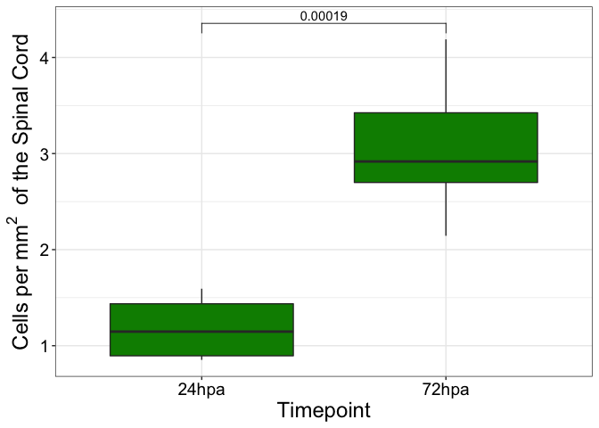
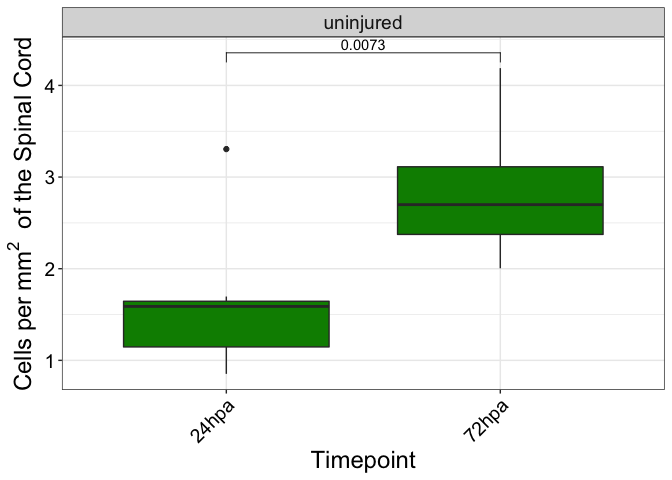
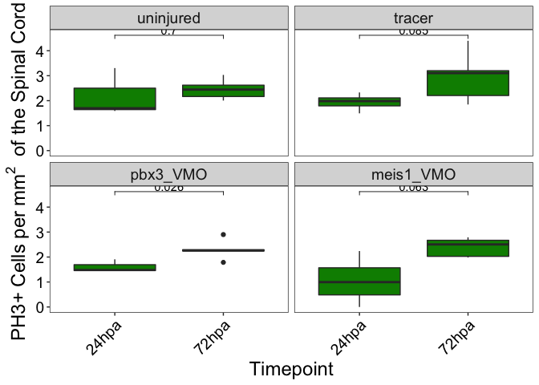

PH3 Cells in Regen
================
Anneke Kakebeen
8/14/2019 (Revised 09/27/19)

-   [Set up](#set-up)
-   [Load in data](#load-in-data)
-   [Plot 24hpa and 72hpa](#plot-24hpa-and-72hpa)
    -   [per one clutch](#per-one-clutch)
    -   [per both clutches](#per-both-clutches)
-   [Plot morphants](#plot-morphants)

Set up
------

Load in data
------------

Plot 24hpa and 72hpa
--------------------

### per one clutch

### per both clutches

Plot morphants
--------------

