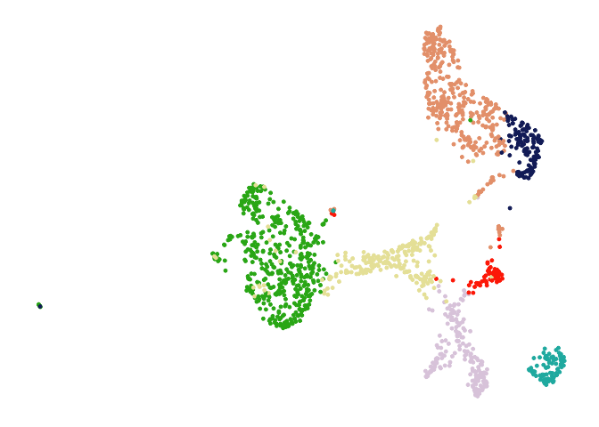
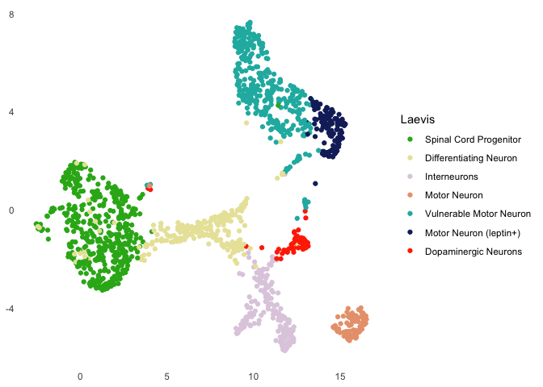
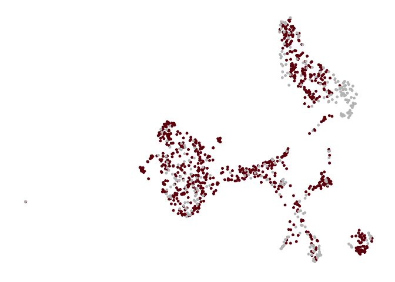
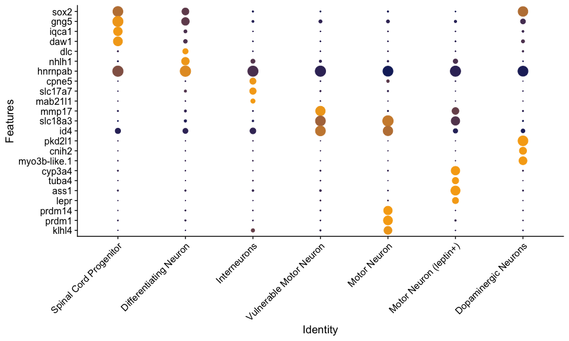
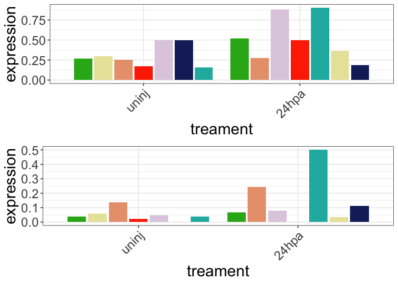
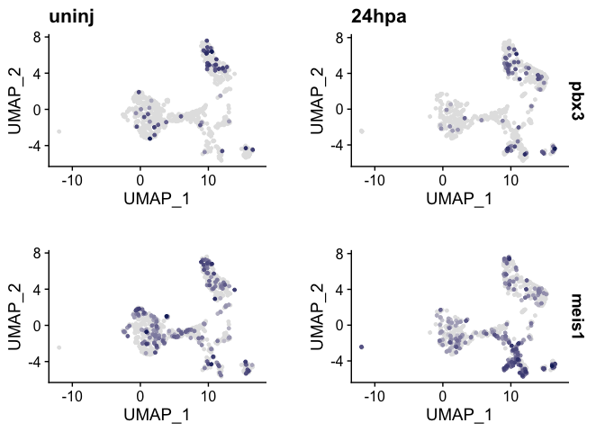
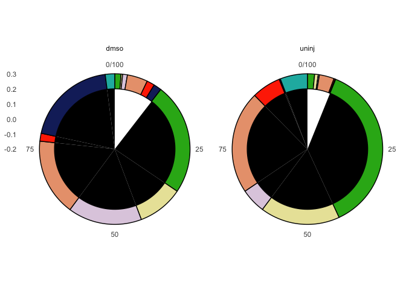

Single Cell Figures
================
Anneke Kakebeen
13 Aug 2019

-   [Set up for scRNA-Seq Figures](#set-up-for-scrna-seq-figures)
-   [Read in scRNASeq Objects](#read-in-scrnaseq-objects)
-   [Figure 4a: UMAP of all neural cells](#figure-4a-umap-of-all-neural-cells)
-   [Figure 4b: UMAP of all neural cells colored for condition (uninjured or 24hpa)](#figure-4b-umap-of-all-neural-cells-colored-for-condition-uninjured-or-24hpa)
-   [Figure 4C: Marker dotplot for neural cell clusters](#figure-4c-marker-dotplot-for-neural-cell-clusters)
-   [Figure 4D-G: cell cluster proportions](#figure-4d-g-cell-cluster-proportions)
    -   [Set up data table](#set-up-data-table)
    -   [Pie Charts](#pie-charts)
    -   [UMAPS](#umaps)
-   [Figure 4E: Cell cycle phase prediction](#figure-4e-cell-cycle-phase-prediction)
    -   [Table set up](#table-set-up)
    -   [Pie Charts](#pie-charts-1)
    -   [UMAP](#umap)
-   [Figure 5E: average expression of meis1 and pbx3 over sc clusters](#figure-5e-average-expression-of-meis1-and-pbx3-over-sc-clusters)
-   [featuremap to show expression of pbx3 and meis1 across neural clusters](#featuremap-to-show-expression-of-pbx3-and-meis1-across-neural-clusters)
-   [Figure 5F: sunbiurst of number of cells that express pbx3 and meis 1](#figure-5f-sunbiurst-of-number-of-cells-that-express-pbx3-and-meis-1)

Set up for scRNA-Seq Figures
----------------------------

``` r
# load packages
library(Seurat)
library(LaCroixColoR)
library(ggplot2)
library(cowplot)
library(tidyr)
library(DT)
library(dplyr)
library(ggpubr)
library(rmarkdown)
library(knitr)

# load functions
source("~/Desktop/pax6 paper/Final Markdowns/common_source_functions.R")

# Set colors
my.color.neural <- c("#2CB11B", "#E9E4A6", "#DFCEE0" , "#E9A17C", "#1BB6AF" , "#172869" , "#FF3200")
condition.color <- c( "#6F0909", "#C0C0C0")
cc_colors <- c((lacroix_palette("Lime"))[c(1,3)], "black")

# Set working directory
setwd("~/Desktop/pax6 paper/Final Markdowns/SingleCell/analysis/")
```

Read in scRNASeq Objects
------------------------

Figure 4a: UMAP of all neural cells
-----------------------------------



Figure 4b: UMAP of all neural cells colored for condition (uninjured or 24hpa)
------------------------------------------------------------------------------



Figure 4C: Marker dotplot for neural cell clusters
--------------------------------------------------



Figure 4D-G: cell cluster proportions
-------------------------------------

### Set up data table

### Pie Charts


    ## # A tibble: 14 x 3
    ## # Groups:   condition [2]
    ##    condition cluster                    sum
    ##    <fct>     <fct>                    <dbl>
    ##  1 uninj     Spinal Cord Progenitor  38.5  
    ##  2 uninj     Differentiating Neuron  17.9  
    ##  3 uninj     Interneurons             5.61 
    ##  4 uninj     Vulnerable Motor Neuron 25.3  
    ##  5 uninj     Dopaminergic Neurons     5.99 
    ##  6 uninj     Motor Neuron (leptin+)   0.255
    ##  7 uninj     Motor Neuron             6.51 
    ##  8 dmso      Spinal Cord Progenitor  25.3  
    ##  9 dmso      Differentiating Neuron  10.1  
    ## 10 dmso      Interneurons            16.9  
    ## 11 dmso      Vulnerable Motor Neuron 20.9  
    ## 12 dmso      Dopaminergic Neurons     2.03 
    ## 13 dmso      Motor Neuron (leptin+)  21.3  
    ## 14 dmso      Motor Neuron             3.38

### UMAPS


    ## List of 8
    ##  $ axis.line.x : list()
    ##   ..- attr(*, "class")= chr [1:2] "element_blank" "element"
    ##  $ axis.line.y : list()
    ##   ..- attr(*, "class")= chr [1:2] "element_blank" "element"
    ##  $ axis.title.x: list()
    ##   ..- attr(*, "class")= chr [1:2] "element_blank" "element"
    ##  $ axis.title.y: list()
    ##   ..- attr(*, "class")= chr [1:2] "element_blank" "element"
    ##  $ axis.text.x : list()
    ##   ..- attr(*, "class")= chr [1:2] "element_blank" "element"
    ##  $ axis.text.y : list()
    ##   ..- attr(*, "class")= chr [1:2] "element_blank" "element"
    ##  $ axis.ticks.x: list()
    ##   ..- attr(*, "class")= chr [1:2] "element_blank" "element"
    ##  $ axis.ticks.y: list()
    ##   ..- attr(*, "class")= chr [1:2] "element_blank" "element"
    ##  - attr(*, "class")= chr [1:2] "theme" "gg"
    ##  - attr(*, "complete")= logi FALSE
    ##  - attr(*, "validate")= logi TRUE

Figure 4E: Cell cycle phase prediction
--------------------------------------

### Table set up

### Pie Charts


    ## # A tibble: 6 x 3
    ## # Groups:   condition [2]
    ##   condition phase   sum
    ##   <fct>     <fct> <dbl>
    ## 1 uninj     S     30.4 
    ## 2 uninj     G2M   17.0 
    ## 3 uninj     G1    52.7 
    ## 4 dmso      S     16.2 
    ## 5 dmso      G2M    7.77
    ## 6 dmso      G1    76.0

### UMAP


    ## List of 8
    ##  $ axis.line.x : list()
    ##   ..- attr(*, "class")= chr [1:2] "element_blank" "element"
    ##  $ axis.line.y : list()
    ##   ..- attr(*, "class")= chr [1:2] "element_blank" "element"
    ##  $ axis.title.x: list()
    ##   ..- attr(*, "class")= chr [1:2] "element_blank" "element"
    ##  $ axis.title.y: list()
    ##   ..- attr(*, "class")= chr [1:2] "element_blank" "element"
    ##  $ axis.text.x : list()
    ##   ..- attr(*, "class")= chr [1:2] "element_blank" "element"
    ##  $ axis.text.y : list()
    ##   ..- attr(*, "class")= chr [1:2] "element_blank" "element"
    ##  $ axis.ticks.x: list()
    ##   ..- attr(*, "class")= chr [1:2] "element_blank" "element"
    ##  $ axis.ticks.y: list()
    ##   ..- attr(*, "class")= chr [1:2] "element_blank" "element"
    ##  - attr(*, "class")= chr [1:2] "theme" "gg"
    ##  - attr(*, "complete")= logi FALSE
    ##  - attr(*, "validate")= logi TRUE

Figure 5E: average expression of meis1 and pbx3 over sc clusters
----------------------------------------------------------------

    ## [1] " 6hpa_Gene:meis1 -> 24hpa_TF:meis1 -> 72hpa_TF:runx|etv1|klf9"

    ## [1] " 6hpa_Gene:etv1 -> 24hpa_TF:etv1 -> 72hpa_TF:pbx3"



featuremap to show expression of pbx3 and meis1 across neural clusters
----------------------------------------------------------------------



Figure 5F: sunbiurst of number of cells that express pbx3 and meis 1
--------------------------------------------------------------------

``` r
# get pax meta data
pax.meta <- pax.neural[[]] # get datat
pax.meta$cell <- rownames(pax.meta) # add colnames of cell id

# get TRUE/FALSE if cell is expressing genes of interets
# pbx3
pbx3.neural <- as.data.frame(GetAssayData(object = pax.neural)["pbx3",] >0)
colnames(pbx3.neural) <- "pbx3"
pbx3.neural$cell <- rownames(pbx3.neural)
#meis1
meis1.neural <- as.data.frame(GetAssayData(object = pax.neural)["meis1",] >0)
colnames(meis1.neural) <- "meis1"
meis1.neural$cell <- rownames(meis1.neural)

# merge meta and gene data frames
pbx3.neural <- merge.data.frame(pax.meta, pbx3.neural, by = "cell") #pbx3
meis1.neural <- merge.data.frame(pax.meta, meis1.neural, by = "cell") #meis1

# get frequency of cells expressing or not expressing gene
#pbx3
pbx3.neural.plot <- as.data.frame(table(pbx3.neural$Laevis, pbx3.neural$pbx3, pbx3.neural$condition))
colnames(pbx3.neural.plot) <- c("cluster", "expression", "condition", "frequency")
#meis1
meis1.neural.plot <- as.data.frame(table(meis1.neural$Laevis, meis1.neural$meis1, meis1.neural$condition))
colnames(meis1.neural.plot) <- c("cluster", "expression", "condition", "frequency")

# get total number of cells per condition
total.pbx <- as.data.frame(table(pbx3.neural$condition)) #pbx3
total.meis <- as.data.frame(table(meis1.neural$condition))#meis1

# merge total and gene data frames and make percentage column
# pbx
pbx3.neural.plot <- merge.data.frame(pbx3.neural.plot, total.pbx, by.x = "condition", by.y = "Var1")
pbx3.neural.plot$percent <- pbx3.neural.plot$frequency/pbx3.neural.plot$Freq*100
pbx3.neural.plot <- pbx3.neural.plot %>% mutate(id = seq(expression))
pbx3.neural.plot <- filter(pbx3.neural.plot, condition %in% c("dmso", "uninj"))
#meis
meis1.neural.plot <- merge.data.frame(meis1.neural.plot, total.pbx, by.x = "condition", by.y = "Var1")
meis1.neural.plot$percent <- meis1.neural.plot$frequency/meis1.neural.plot$Freq*100
meis1.neural.plot <- meis1.neural.plot %>% mutate(id = seq(expression))
meis1.neural.plot <- filter(meis1.neural.plot, condition %in% c("dmso", "uninj"))

 
plotcolors <- c("#E9E4A6", "#1BB6AF", "black", "#DFCEE0","#FF3200",  "#172869" ,"#2CB11B", "white",  "#E9A17C" )

# plot pbx3
ggplot(pbx3.neural.plot, 
       aes(y = percent, group = expression)) +
  geom_col(aes(fill = expression, x = 0), width = .4) + 
  geom_col(aes(fill = cluster, x = .25), width = .1, color="black") +
  coord_polar(theta = 'y') + 
  blank_theme +
  facet_grid(.~condition)+
  scale_fill_manual(values = plotcolors) +
  theme(legend.position = "none")
```



``` r
# plot meis1
ggplot(meis1.neural.plot, 
       aes(y = percent, group = expression)) +
  geom_col(aes(fill = expression, x = 0), width = .4) + 
  geom_col(aes(fill = cluster, x = .25), width = .1, color="black") +
  coord_polar(theta = 'y') + 
  blank_theme +
  facet_grid(.~condition)+
    scale_fill_manual(values = plotcolors) +
  theme(legend.position = "none")
```


