Single Cell Figures
================
Anneke Kakebeen
13 Aug 2019

-   [Set up for scRNA-Seq Figures](#set-up-for-scrna-seq-figures)
-   [Read in scRNASeq Objects](#read-in-scrnaseq-objects)
-   [Figure 4a: UMAP of all neural cells](#figure-4a-umap-of-all-neural-cells)
-   [Figure 4b: UMAP of all neural cells colored for condition (uninjured or 24hpa)](#figure-4b-umap-of-all-neural-cells-colored-for-condition-uninjured-or-24hpa)
-   [Figure 4C: Marker dotplot for neural cell clusters](#figure-4c-marker-dotplot-for-neural-cell-clusters)
-   [Figure 4D-G: cell cluster proportions](#figure-4d-g-cell-cluster-proportions)
    -   [Set up data table](#set-up-data-table)
    -   [Pie Charts](#pie-charts)
    -   [UMAPS](#umaps)
-   [Figure 4E: Cell cycle phase prediction](#figure-4e-cell-cycle-phase-prediction)
    -   [Table set up](#table-set-up)
    -   [Pie Charts](#pie-charts-1)
    -   [UMAP](#umap)
-   [Figure 5E: average expression of meis1 and pbx3 over sc clusters](#figure-5e-average-expression-of-meis1-and-pbx3-over-sc-clusters)
-   [Figure 5F: sunburst of number of cells that express pbx3 and meis 1](#figure-5f-sunburst-of-number-of-cells-that-express-pbx3-and-meis-1)
-   [Figure 6: Feature plots and dotplots of each differentiation marker](#figure-6-feature-plots-and-dotplots-of-each-differentiation-marker)

Set up for scRNA-Seq Figures
----------------------------

``` r
# load packages
library(Seurat)
library(LaCroixColoR)
library(ggplot2)
library(cowplot)
library(tidyr)
library(DT)
library(dplyr)
library(ggpubr)
library(rmarkdown)
library(knitr)
library(patchwork)

# load functions
source("~/Desktop/pax6 paper/Final Markdowns/common_source_functions.R")

# Set colors
my.color.neural <- c("#2CB11B", # NPC
                     "#F73BEE", # Floor plate
                     "#E9E4A6", # DiffN
                     "#DFCEE0" , # IN
                     "#E9A17C", # VMN
                     "#FF3200", # MN
                     "#172869" , # MNL
                     "#1BB6AF" ) # DN

condition.color <- c( "#6F0909", # 24hpa
                      "#C0C0C0") # uninj
cc_colors <- c((lacroix_palette("Lime"))[c(1,3)], "black")

# Set working directory
setwd("~/Desktop/pax6 paper/Final Markdowns/SingleCell_1/analysis/")
```

Read in scRNASeq Objects
------------------------

Figure 4a: UMAP of all neural cells
-----------------------------------

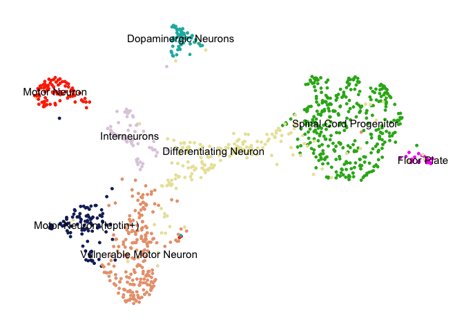

Figure 4b: UMAP of all neural cells colored for condition (uninjured or 24hpa)
------------------------------------------------------------------------------


Figure 4C: Marker dotplot for neural cell clusters
--------------------------------------------------

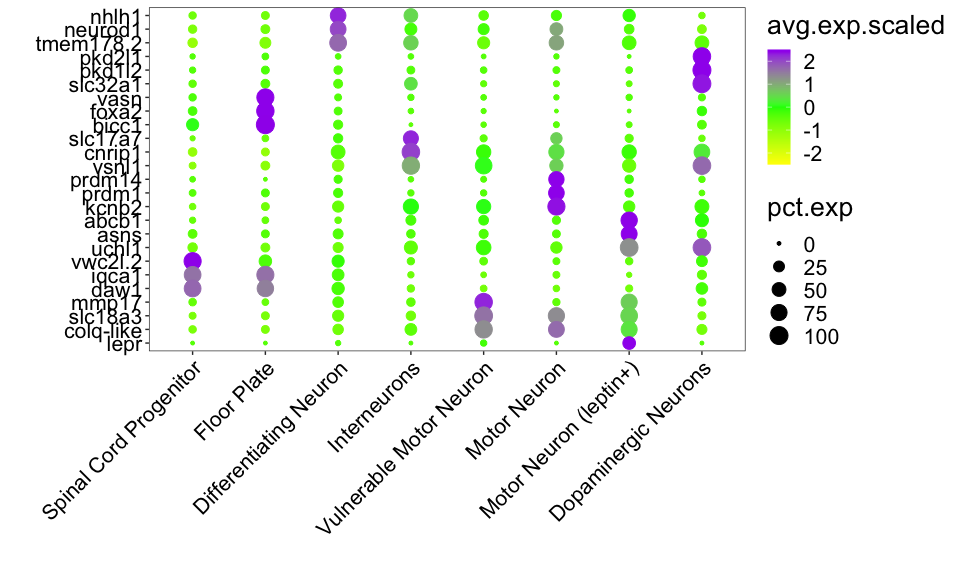

Figure 4D-G: cell cluster proportions
-------------------------------------

### Set up data table

### Pie Charts


    ## # A tibble: 6 x 3
    ## # Groups:   condition [2]
    ##   condition  `nCells.neural$class`   sum
    ##   <fct>      <fct>                 <dbl>
    ## 1 uninj      NSC                    38.0
    ## 2 uninj      Differentiating        19.8
    ## 3 uninj      Neuron                 42.1
    ## 4 regenerate NSC                    24.7
    ## 5 regenerate Differentiating        10.5
    ## 6 regenerate Neuron                 64.9

### UMAPS


Figure 4E: Cell cycle phase prediction
--------------------------------------

### Table set up

### Pie Charts


    ## # A tibble: 6 x 3
    ## # Groups:   condition [2]
    ##   condition  phase   sum
    ##   <fct>      <fct> <dbl>
    ## 1 uninj      S     30.2 
    ## 2 uninj      G2M   15.5 
    ## 3 uninj      G1    54.3 
    ## 4 regenerate S     16.6 
    ## 5 regenerate G2M    7.43
    ## 6 regenerate G1    76.0

### UMAP


Figure 5E: average expression of meis1 and pbx3 over sc clusters
----------------------------------------------------------------

    ## [1] " 6hpa_Gene:meis1 -> 24hpa_TF:meis1 -> 72hpa_TF:runx|etv1|klf9"

    ## [1] " 6hpa_Gene:etv1 -> 24hpa_TF:etv1 -> 72hpa_TF:pbx3"


Figure 5F: sunburst of number of cells that express pbx3 and meis 1
-------------------------------------------------------------------

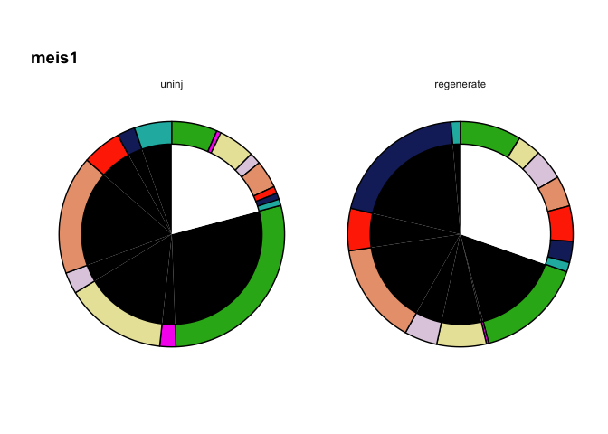

    ## # A tibble: 4 x 3
    ## # Groups:   condition [2]
    ##   condition  expression   sum
    ##   <fct>      <fct>      <dbl>
    ## 1 uninj      FALSE       79.1
    ## 2 uninj      TRUE        20.9
    ## 3 regenerate FALSE       69.6
    ## 4 regenerate TRUE        30.4

    ## # A tibble: 4 x 3
    ## # Groups:   condition [2]
    ##   condition  expression   sum
    ##   <fct>      <fct>      <dbl>
    ## 1 uninj      FALSE      93.9 
    ## 2 uninj      TRUE        6.15
    ## 3 regenerate FALSE      89.5 
    ## 4 regenerate TRUE       10.5

Figure 6: Feature plots and dotplots of each differentiation marker
-------------------------------------------------------------------

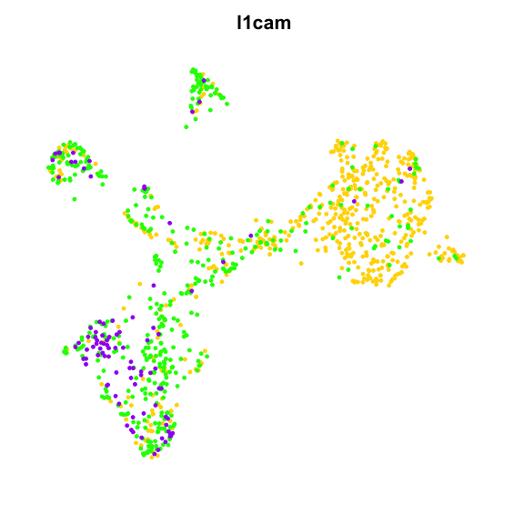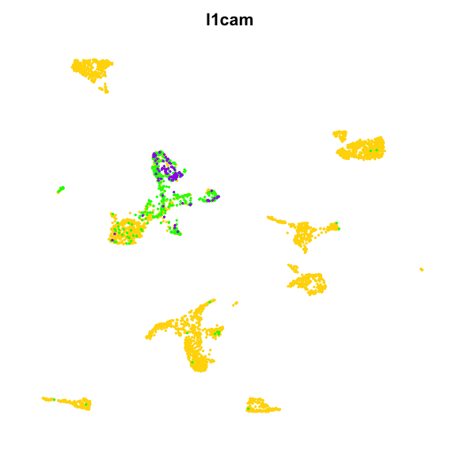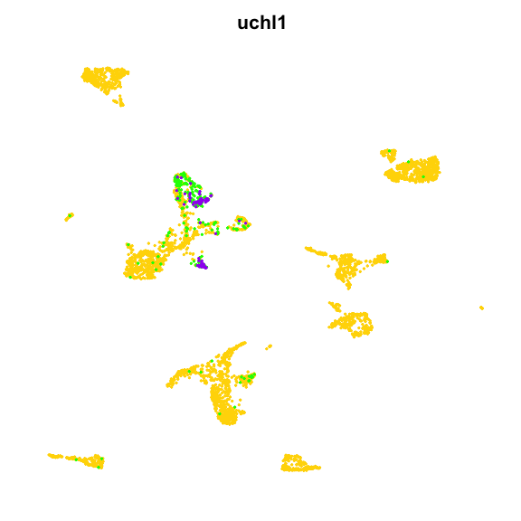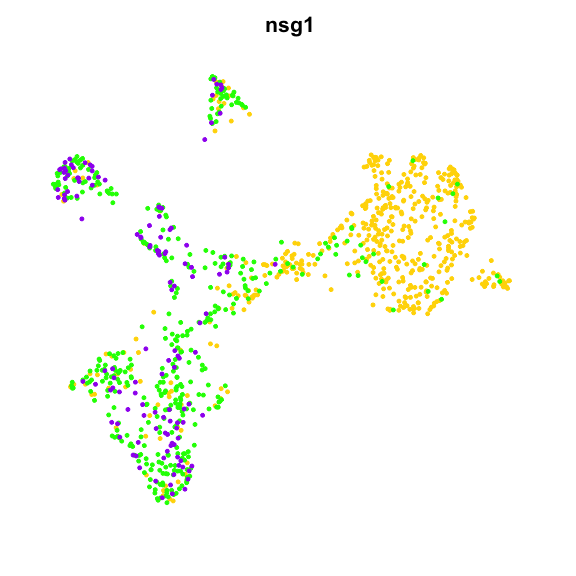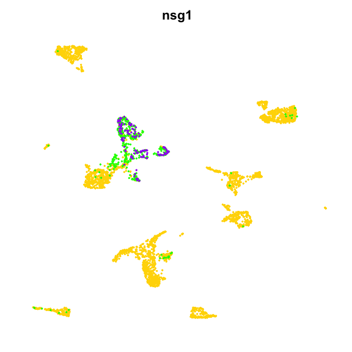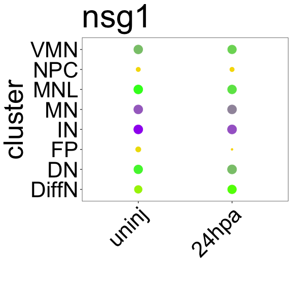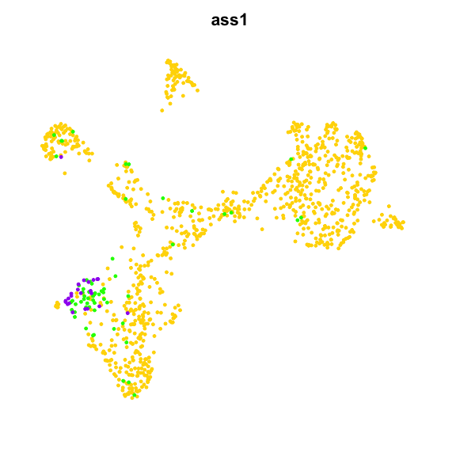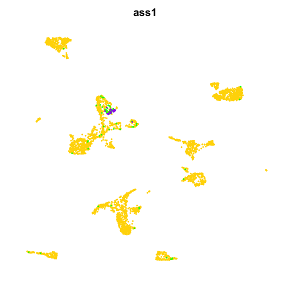
