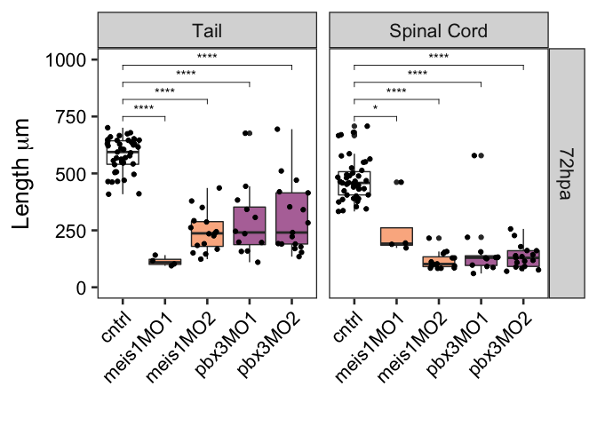
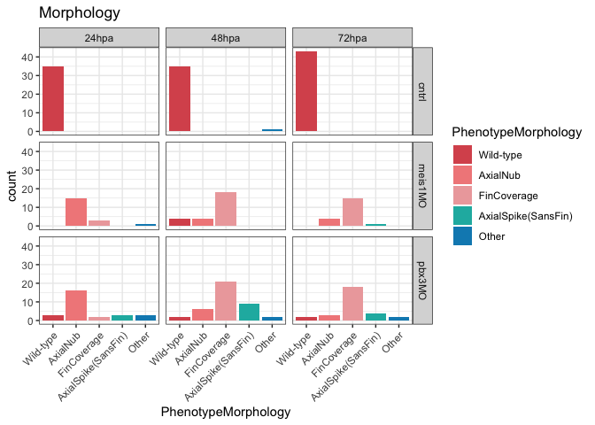
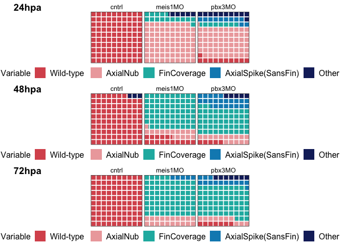

Tail Measurements
================
Anneke Kakebeen
8/14/2019 (Revised 09/27/19)

-   [Set up](#set-up)
-   [Load in data](#load-in-data)
-   [Figure 6AA: Plot tail measurement data](#figure-6aa-plot-tail-measurement-data)
    -   [All Timepoints](#all-timepoints)
    -   [Plot only 72hpa for figure](#plot-only-72hpa-for-figure)
-   [Plot phenotypic analysis of coded phenotypes](#plot-phenotypic-analysis-of-coded-phenotypes)
    -   [Descriptors](#descriptors)
    -   [Plot Phenotype Morphology: Histogram](#plot-phenotype-morphology-histogram)
    -   [Plot Phenotype Morphology:Stacked bar](#plot-phenotype-morphologystacked-bar)
    -   [Plot Phenotype Morphology: Waffle chart](#plot-phenotype-morphology-waffle-chart)

Set up
------

Load in data
------------

Figure 6AA: Plot tail measurement data
--------------------------------------

### All Timepoints

### Plot only 72hpa for figure

Plot phenotypic analysis of coded phenotypes
--------------------------------------------

### Descriptors

### Plot Phenotype Morphology: Histogram

### Plot Phenotype Morphology:Stacked bar

### Plot Phenotype Morphology: Waffle chart

